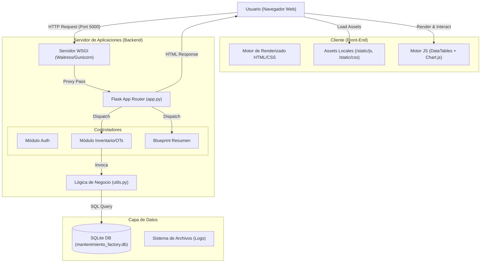
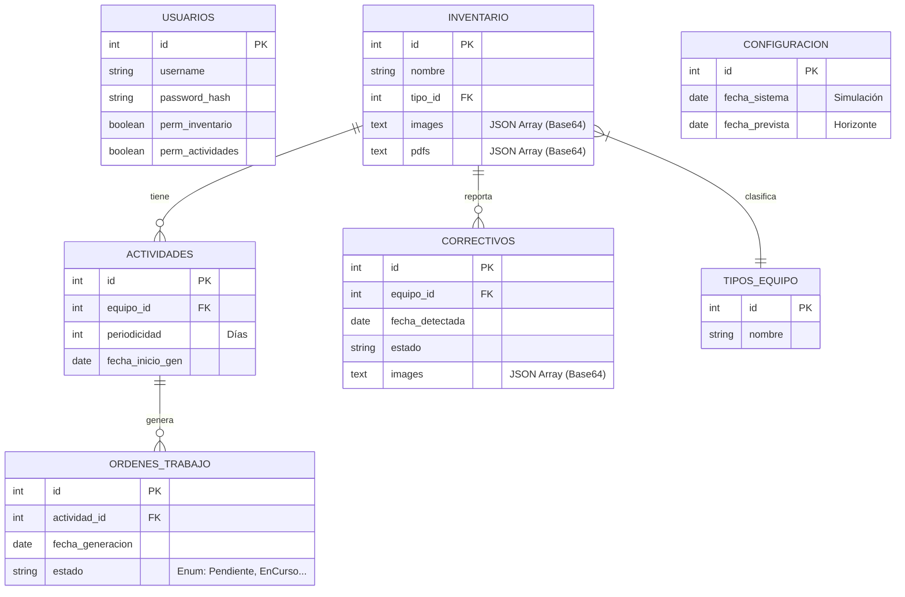
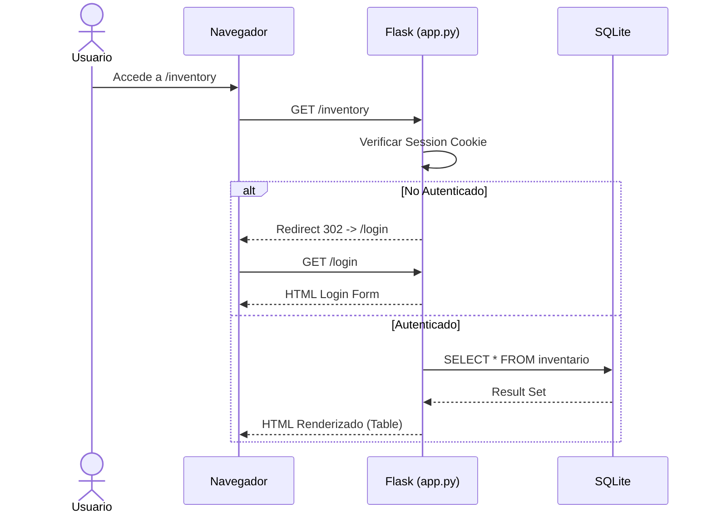
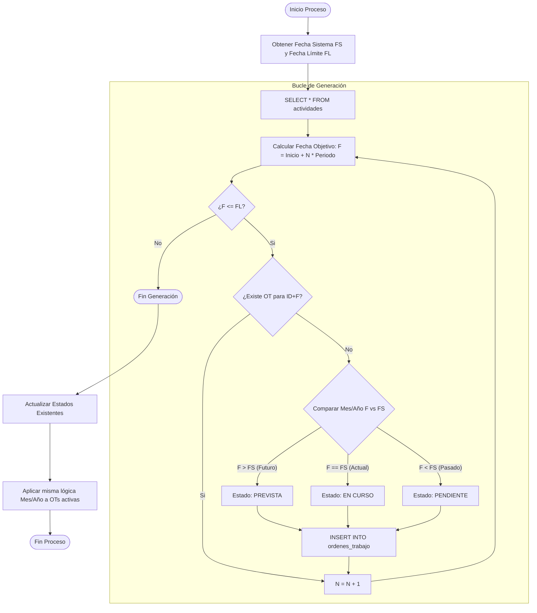
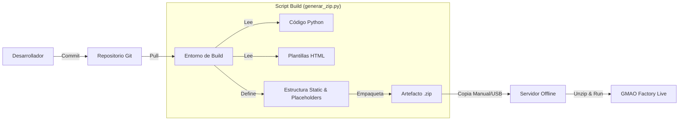

# **🛠️ Manual Técnico del Desarrollador: GMAO Factory**

Versión del Software: v6.08 (Stable / Offline Edition)  
Fecha de Revisión: 03/01/2026  
Audiencia: Desarrolladores Backend, Arquitectos de Software, DevOps.

## **1\. Introducción y Stack Tecnológico**

**GMAO Factory** es una plataforma monolítica de gestión de mantenimiento industrial (CMMS) diseñada para operar en entornos **Air-gapped** (sin conexión a internet). Su arquitectura prioriza la portabilidad total: el sistema completo (código, base de datos y assets) se distribuye como un único artefacto comprimido.

### **Propósito del Sistema**

Gestionar el ciclo de vida de activos industriales, planificar mantenimientos preventivos mediante generación determinista de Órdenes de Trabajo (OTs) y gestionar incidencias correctivas.

### **Stack Tecnológico**

| Capa | Tecnología | Versión | Justificación Técnica |
| :---- | :---- | :---- | :---- |
| **Backend** | Python | 3.8+ | Lógica de servidor robusta y multiplataforma. |
| **Framework** | Flask | 3.0.0 | Micro-framework WSGI ligero y modular (Blueprints). |
| **Persistencia** | SQLite | 3.x | Base de datos relacional embebida (Zero-conf). |
| **Frontend** | Jinja2 \+ HTML5 | N/A | Renderizado en servidor (SSR). |
| **UI Framework** | Bootstrap | 5.3 | Sistema de diseño responsivo (archivos locales). |
| **Client-Scripting** | jQuery \+ DataTables | 1.13 | Gestión de datos tabulares, filtrado avanzado y exportación en cliente. |
| **Dataviz** | Chart.js | 4.x | Visualización de KPIs sin dependencias externas pesadas. |

### **Dependencias Principales (requirements.txt)**

Flask==3.0.0  
Werkzeug==3.0.0  
waitress==2.1.2  \# Servidor WSGI recomendado para producción

## **2\. Arquitectura del Sistema**

El sistema sigue un patrón arquitectónico **Monolítico Modular** basado en **MVC (Modelo-Vista-Controlador)**.

* **Modelo:** Definido en database.py (DDL) y utils.py (Lógica). Uso de SQL nativo.  
* **Vista:** Plantillas en templates/ renderizadas por Jinja2.  
* **Controlador:** Rutas en app.py y resumen.py.

### **Diagrama de Arquitectura de Alto Nivel**

## **3\. Guía de Configuración (Setup)**

Pasos para levantar el entorno de desarrollo.

### **Prerrequisitos**

* Python 3.8 o superior.  
* Entorno virtual (venv) recomendado.

### **Instalación**

1. Clonar/Descomprimir:  
   Extraer el artefacto gmao\_factory\_v6\_08\_checkboxes\_everywhere.zip.  
2. **Configurar Entorno Virtual:**  
   python \-m venv venv  
   \# Windows:  
   venv\\Scripts\\activate  
   \# Linux/Mac:  
   source venv/bin/activate

3. **Instalar Dependencias:**  
   pip install Flask Werkzeug waitress

4. Verificación de Assets Estáticos (CRÍTICO):  
   Para que las funcionalidades de exportación y selección funcionen offline, la carpeta static/js debe contener datatables.min.js compilado con las extensiones Buttons, HTML5 Export, Print y Select.  
5. **Ejecución:**  
   python app.py

   *La base de datos se autogenera en el primer inicio.*

## **4\. Documentación de la API / Puntos de Entrada**

El sistema utiliza **Server-Side Rendering**. Los endpoints devuelven HTML completo.

### **Autenticación**

* **Mecanismo:** Cookies de sesión firmadas (session\['user\_id'\]).  
* **Seguridad:** Decoradores @utils.login\_required y @utils.permission\_required.

### **Endpoints Clave**

| Método | Ruta | Descripción | Payload Relevante |
| :---- | :---- | :---- | :---- |
| POST | /login | Autenticación. | username, password |
| POST | /inventory/add | Crea activo. | multipart/form-data (img, pdf) |
| POST | /work\_orders/generate | **Trigger Core:** Generación de OTs. | Ninguno (usa fecha sistema DB) |
| GET | /resumen/ | Dashboard (Blueprint). | \- |
| POST | /settings/update\_planned\_date | Actualiza horizonte planificación. | fecha\_prevista |

## **5\. Flujos de Datos**

### **Diagrama de Entidad-Relación (ERD)**

La persistencia de archivos se realiza almacenando cadenas **Base64** en columnas TEXT, lo que permite backups mediante copia simple del archivo .db.  

### **Diagrama de Secuencia: Flujo de Autenticación**

## **6\. Diagrama de Flujo (Lógica Core)**

El proceso crítico es **generate\_and\_update\_work\_orders** en utils.py. Determina los estados de las OTs basándose en la comparación de Mes/Año.

### **Lógica de Estados (v6.08)**

1. **En Curso:** Fecha OT pertenece al **mismo mes y año** que la fecha del sistema.  
2. **Pendiente:** Fecha OT es **anterior** al mes/año actual.  
3. **Prevista:** Fecha OT es **posterior** al mes/año actual.

## **7\. Guía de Contribución y CI/CD**

El desarrollo se centra en la estabilidad y la capacidad offline.

### **Estándares**

* **Python:** PEP 8\.  
* **Frontend:** Bootstrap 5 (clases utilitarias).  
* **SQL:** Consultas parametrizadas (?) obligatorias para evitar SQL Injection.

### **Pipeline de Construcción (CI/CD Local)**

Dado el despliegue mediante copia de archivos, el "CI/CD" es la generación del artefacto.  
