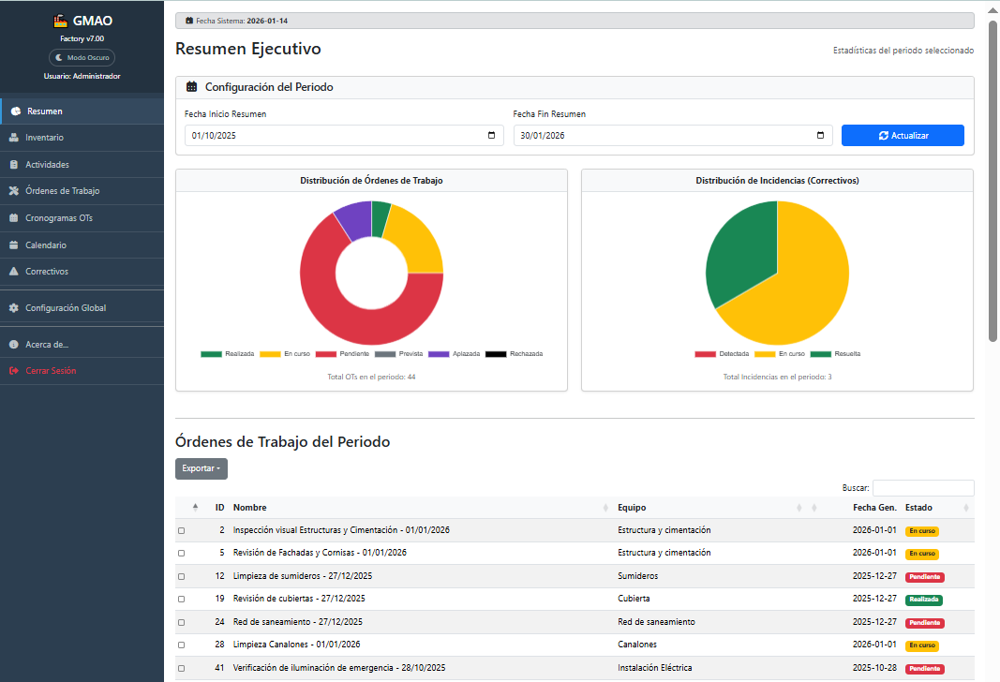

# **📘 Manual de Usuario: GMAO Factory**

Versión del Software: 7.00
Fecha de Actualización: 14/01/2026

## **1\. Introducción**

Bienvenido a **GMAO Factory**, su sistema integral para la Gestión de Mantenimiento Asistido por Ordenador.  
El objetivo principal de este programa es facilitar el día a día en la pequeña planta o instalación industrial, talleres, edificios, etc. permitiendo llevar un control riguroso de los equipos, planificar el mantenimiento preventivo para evitar paradas inesperadas y gestionar de forma rápida las averías (mantenimiento correctivo).  
**¿Qué le permite hacer este software?**

* **Centralizar la información:** Tener todos los equipos, manuales y fotos en un solo lugar.  
* **Automatizar tareas:** El sistema le avisa cuándo toca realizar un mantenimiento.  
* **Trabajar sin conexión:** Puede utilizar el programa en una red interna sin necesidad de internet.  
* **Analizar datos:** Ver gráficas de cumplimiento y exportar informes a Excel o PDF.

## **2\. Requisitos del Sistema**

Para utilizar GMAO Factory, su equipo informático solo necesita cumplir con lo siguiente:

* **Sistema Operativo:** Windows 10/11, Linux o macOS.  
* **Navegador Web:** Google Chrome, Microsoft Edge o Mozilla Firefox (actualizados).  
* **Software Base:** Tener instalado **Python 3.13** o superior.  
* **Conectividad:** \* No requiere Internet para funcionar (Modo Offline).  
* Requiere conexión a la red local (LAN) si accede al servidor desde otro ordenador/movil/tablet.

## **3\. Guía de Instalación y Configuración**
Siga estos pasos para poner en marcha el sistema por primera vez.

### **Paso 1: Ubicación de Archivos**
Descarga la última versión desde https://github.com/jsbsan/GMAO-FACTORY en el apartado Releases: https://github.com/jsbsan/GMAO-FACTORY/releases
Descomprima el archivo **Source code.zip** en una carpeta de su ordenador o servidor (ej: C:\\GMAO\_Factory). Se descomprimirán varias carpetas (docs, ejemplos, Prompt, src,...). Dentro de la carpeta src, están los ficheros .py y las carpetas de templates y static.

### **Paso 2: Verificación de Librerías (Importante para Modo Offline)**

El sistema está diseñado para funcionar sin internet. Verifique que dentro de la carpeta /src/static/ existan los archivos de estilos y scripts necesarios (Bootstrap, DataTables, Chart.js). 
*Si estos archivos faltan, la aplicación funcionará pero se verá visualmente incorrecta.*

### **Paso 3: Iniciar el Programa**

1. Abra una terminal o consola de comandos (CMD).  
2. Navegue hasta la carpeta del proyecto. (/scr)  
3. Escriba el siguiente comando y pulse Enter:  
   python app.py
4. Verá un mensaje indicando que el servidor está corriendo (normalmente en `http://0.0.0.0:5000`).

### **Paso 4: Acceso**
Abra su navegador web y escriba la dirección:
* Si está en el mismo PC: `http://localhost:5000`  
* Si accede desde otro PC: `http://[DIRECCION_IP_DEL_SERVIDOR]:5000`

---

## **4\. Interfaz de Usuario**

La interfaz está diseñada para ser intuitiva. Se divide en tres zonas:

### **A. Barra Lateral (Menú de Navegación)**

Situada a la izquierda (color oscuro). Desde aquí accede a los módulos principales:
* **Modo Oscuro / Modo Claro:** Puedes cambiar los colores de la aplicación a claro o oscuro.
* **Resumen:** Panel de control con gráficas y tablas generales según intervalo de fecha que definas.  
* **Inventario:** Catálogo de máquinas/instalaciones.  
* **Actividades:** Definición de las actividades que forman el plan de mantenimiento.  
* **Órdenes de Trabajo (OTs):** Lista de Ordenes de Trabajos por fecha, generadas por la periodicidad indicada en la actividades.
* **Cronograma:** Calendario visual anual de ordenes de trabajos.  
* **Calendario:** Calendario visual mensual de ordenes de trabajos.
* **Correctivos:** Gestión de averías/incidencias.  
* **Configuración Global:** (Solo administradores) Usuarios, fechas, copia de seguridad de la base de datos, 

### **B. Área de Trabajo**

La zona central donde se muestra la información.

* **Tablas de Datos:** Todas las listas (inventario, OTs, etc.) permiten:  
  * **Buscar:** Escriba en el recuadro superior derecho para filtrar instantáneamente.  
  * **Ordenar:** Haga clic en el título de cualquier columna.  
  * **Seleccionar:** Use las **casillas de verificación** a la izquierda para seleccionar varias filas.  
  * **Exportar:** Use los botones **Copiar, Excel, PDF o Imprimir**.  
    * *Nota:* Si selecciona filas, solo se exportarán esas. Si no selecciona ninguna, se exportarán todas las visibles.

* **Botones:** Nuevo (equipo, actividad, incidencia) e Imprimir Todo

### **C. Barra Superior**

Muestra el nombre de la aplicación y el usuario conectado. En móviles, contiene el botón para desplegar el menú.

---

## **5\. Guía de Uso (Paso a Paso)**

### **5.1. Gestión de Inventario**

Para dar de alta una nueva máquina:

1. Vaya a **Inventario** \> **\+ Nuevo Equipo**.  
2. Rellene el **Nombre**, seleccione el **Tipo** (ej: Eléctrico) y añada una **Descripción**.  
3. **Archivos:** Puede subir hasta 5 fotos y 5 manuales PDF.  
4. Pulse **Guardar**.  
5. *Consejo:* Para ver los archivos subidos, use los botones de colores en la columna "Archivos" de la tabla.

### **5.2. Crear un Plan de Mantenimiento (Preventivo)**

Defina qué hay que hacerle a la máquina y cada cuánto tiempo:

1. Vaya a **Actividades** \> **Nueva Actividad**.  
2. Seleccione el **Equipo**.  
3. Indique la **Periodicidad** en días (ej: 30 para mensual, 365 para anual).  
4. Defina la **Fecha de Inicio** (cuándo debe generarse la primera orden).  
5. Describa las **Operaciones** (ej: "Engrasar rodamientos y verificar tensión").  
6. Checkbox de Generar OTs: por defecto siempre se generan. Si posteriormente editas la actividad, puedes desactivar la generación de ordenes de trabajo de la actividad que edites.
7. Pulse **Crear Actividad**.

### **5.3. Gestión de Órdenes de Trabajo (OTs)**

El sistema genera las órdenes automáticamente según la fecha.

1. Vaya a **Órdenes de Trabajo**.  
2. Pulse el botón amarillo **Generar OTs** para forzar la generación de las O.T.s, normalmente se ejecuta automaticamente al modificar actividades y reiniciar la aplicación.
3. **Entendiendo los Colores (Estados):**  
   * Verde **Realizada:** Tarea realizada.
   * Rojo **Pendiente:** Tarea de los meses pasados que no se hiciron.  
   * Amarillo **En Curso:** Tarea planificada para el mes actual.  
   * Gris **Prevista:** Tarea futura (meses siguientes).  
   * Morado **Aplazada:** Tarea aplazada (por vacaciones, no vino la empresa externa, etc).  
   * Negro **Rechazada:** No se ha ejecutado.

4. **Cambiar estado de una OT:**  
   * Localice la tarea y pulse el botón de **Gestionar**.  
   * Por ejemplo, cambie el estado a **Realizada** (verde).  
   * (Opcional) Añada observaciones y la fecha real de ejecución.  
   * Pulse **Actualizar OT**.

### **5.4. Reportar una Avería (Correctivo)**

Por ejemplo, si una máquina se rompe inesperadamente:

1. Vaya a **Correctivos** \> **Nueva Incidencia**.  
2. Seleccione el equipo afectado y describa la avería.  
3. Suba fotos del daño si es necesario.  
4. Estado inicial: **Detectada**.  
5. Cuando se repare, edite la incidencia, escriba la solución y cambie el estado a **Resuelta**. Si se esta resolviendo, existe el estado "En curso"

### **5.5. Uso del Resumen e Informes**

1. Vaya a la pestaña **Resumen**.  
2. Seleccione un rango de fechas en "Configuración del Periodo" y pulse **Actualizar**.  
3. Verá las gráficas de cumplimiento y debajo encontrará las tablas detalladas de OTs y Correctivos de ese periodo.  
4. Pulse el botón verde **Imprimir Informe Completo** al final de la página para generar un reporte en papel o PDF con todos los datos y gráficas.

### **5.6. Cronogramas y Calendarios**

Puedes ver las Ordenes de trabajo, durante el año (en el cronograma) y por meses (en el calendario), y haciendo click en ellas, las puede editar para cambiar su estado, fecha de finalización o/y observaciones.

---

## **6\. Solución de Problemas (FAQ)**

**P: El programa no carga o se ve "feo" (sin colores ni estructura).** 
**R:** Esto sucede cuando el programa no encuentra los archivos de diseño. Asegúrese de que la carpeta `static` está junto al archivo `app.py` y contiene los archivos CSS y JS descargados. Este programa es **Offline-First**, no intenta descargar diseños de internet si no están configurados.

**P: Al exportar a Excel, el archivo está vacío.** 
**R:** El sistema tiene una "Exportación Inteligente". Si ha marcado alguna casilla de verificación en la tabla, el sistema entenderá que *solo* quiere exportar esa selección. Si quiere exportar *todo*, asegúrese de **desmarcar todas las casillas** antes de pulsar el botón Excel.

**P: ¿Cómo recupero mi contraseña?** 
**R:** El sistema no envía correos. Contacte con el administrador del sistema. Si usted es el administrador y ha perdido el acceso, deberá restaurar la base de datos original o acceder al archivo `.db` para resetear el usuario. (Usuario por defecto: `Administrador` / Clave: `123456`).

**P: He creado una actividad pero no veo la Orden de Trabajo.** 
**R:** Las OTs se crean solas inmediatamente, si no se han genereado, debe ir a la sección **Órdenes de Trabajo** y pulsar **Generar OTs**, o bien esperar al día siguiente si el servidor se reinicia. Además, verifique que la "Fecha de Inicio" de la actividad no sea futura.

---

## **7\. Notas Técnicas**

Para el personal de TI o curiosos:

* **Tecnología:** El software está construido en **Python** usando el framework **Flask**.  
* **Base de Datos:** Utiliza **SQLite** (`mantenimiento_factory.db`). Toda la información, incluidas las imágenes y PDFs, se guarda dentro de este único archivo. **Hacer una copia de seguridad es tan fácil como copiar este archivo.**  en el menú de configuración tienes la opción para descargarte la copia deseguridad.
* **Rendimiento:** Las tablas utilizan tecnología de renderizado en el cliente, capaz de gestionar miles de registros con filtrado instantáneo sin recargar la página.

